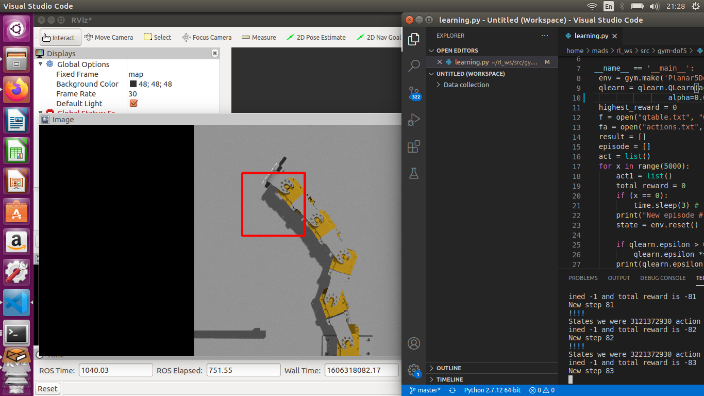
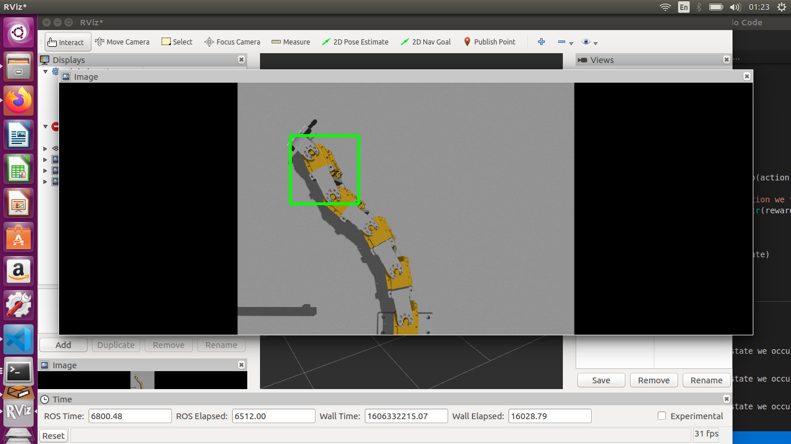

# RL-5DOF
After 2 Hours of Training with modified parameters: 
alpha = 0.1; gamma = 0.95; epsilon = 0.5;

After 4 Hours of Training with modified parameters:  
alpha = 0.01; gamma = 0.8; epsilon = 0.1;

Inspiration taken from:
>https://www.kaggle.com/charel/learn-by-example-reinforcement-learning-with-gym
